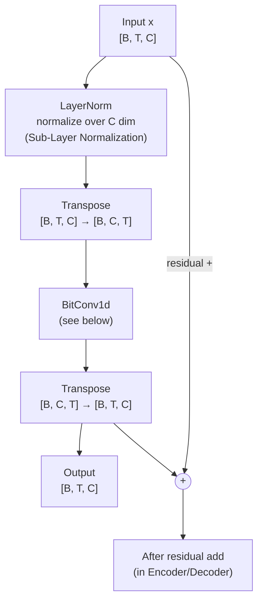
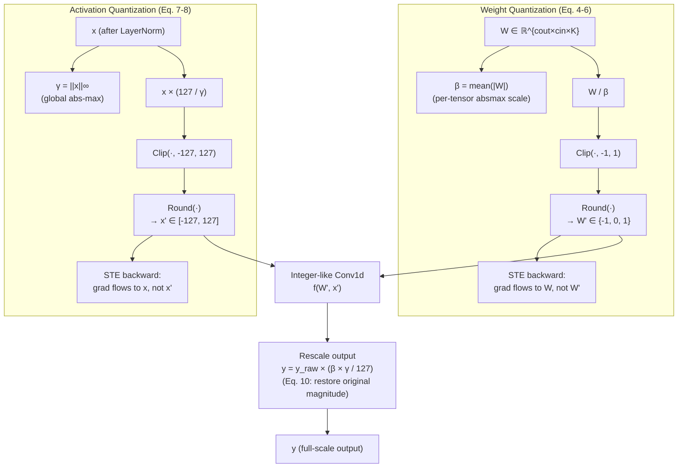
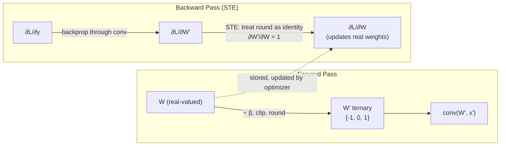
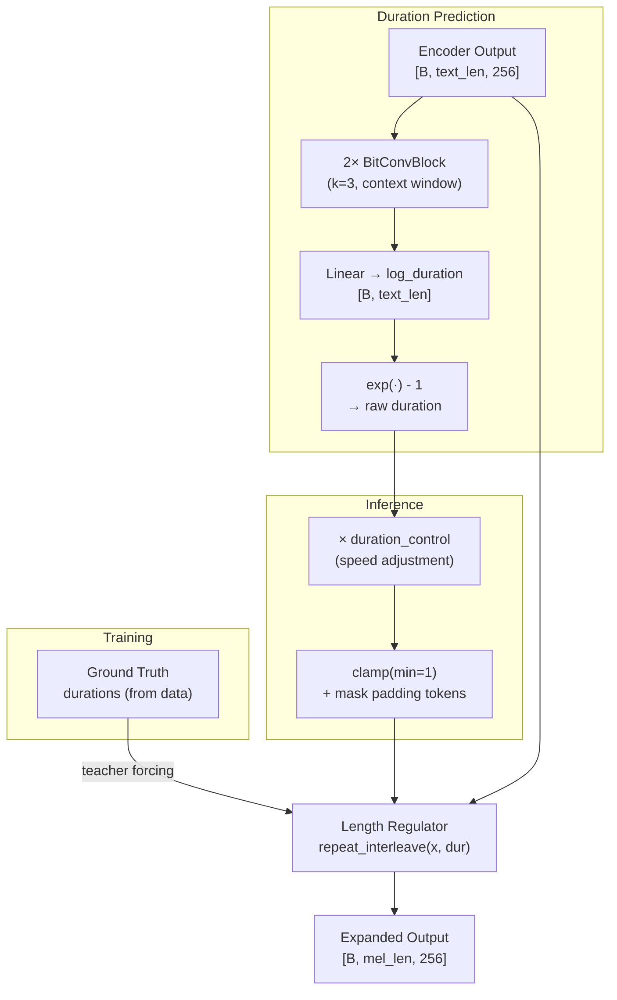
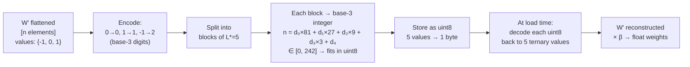
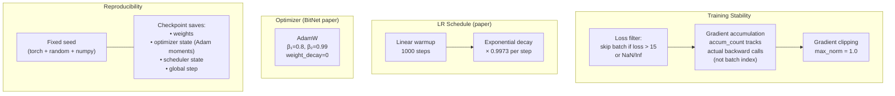

# BitJETS Architecture

BitJETS is a 1.58-bit quantized Text-to-Speech system based on the JETS architecture with BitNet b1.58 quantization applied to all 1D convolutional layers. The core research contribution is demonstrating that extreme ternary weight quantization (`{-1, 0, 1}`) can produce intelligible speech while reducing model size by ~5× compared to FP32.

---

## 1. Full TTS Pipeline


> **Red** = 1.58-bit quantized layers. **Green** = full-precision vocoder (intentionally kept FP32 — quantizing the final waveform generation layer causes severe audio degradation per paper Section 3.2).

---

## 2. BitConvBlock — The Core Quantized Unit

Every encoder and decoder layer is a `BitConvBlock`. This is where the compression happens.



The `LayerNorm → Transpose → BitConv1d → Transpose` pattern is the **SubLN** (Sub-Layer Normalization) design from BitNet b1.58: normalization happens *inside* each sublayer before quantization, stabilizing the input distribution.

---

## 3. BitConv1d — Quantization Math

This is the heart of the 1.58-bit optimization. Both weights and activations are quantized at every forward pass.



### Why this works

| Property | Effect |
|---|---|
| W' ∈ {-1, 0, 1} | Only add/subtract needed, no multiply at inference |
| γ = global `\|\|x\|\|∞` | Single scale per tensor — consistent with paper Eq. 8 |
| β = mean(\|W\|) | Per-tensor scale captures weight distribution |
| Rescale by βγ/Qp | Exactly restores the magnitude of a full-precision conv output |

---

## 4. Straight-Through Estimator (STE)

The core training trick that makes quantization-aware training possible. `Round()` and `Clip()` have zero gradient almost everywhere — STE bypasses this.



**Key insight:** Real-valued weights `W` are always stored and updated by AdamW. `W'` (ternary) is only computed at each forward pass — it's not stored. The STE tells the autograd engine: "pretend `round()` is the identity function during backprop." This lets gradients flow to the real weights, which slowly converge to values that, when rounded, produce good ternary weights.

---

## 5. Model Architecture — Dimensions

```mermaid
block-beta
  columns 3

  block:encoder["BitEncoder"]:1
    EMB["Embedding\n32 → 256"]
    E1["BitConvBlock\n256→256, k=5"]
    E2["BitConvBlock\n256→256, k=5"]
    E3["BitConvBlock\n256→256, k=5"]
    E4["BitConvBlock\n256→256, k=5"]
    LN_E["LayerNorm 256"]
  end

  block:adaptor["VarianceAdaptor"]:1
    DP1["BitConvBlock\n256→256, k=3"]
    DP2["BitConvBlock\n256→256, k=3"]
    LINEAR["Linear 256→1\n(log duration)"]
    LR["Length Regulator\nrepeat_interleave"]
  end

  block:decoder["BitDecoder"]:1
    PROJ["Linear 256→192"]
    D1["BitConvBlock\n192→192, k=5"]
    D2["BitConvBlock\n192→192, k=5"]
    D3["BitConvBlock\n192→192, k=5"]
    D4["BitConvBlock\n192→192, k=5"]
    LN_D["LayerNorm 192"]
    OUT_PROJ["Linear 192→80"]
  end
```



---

## 6. VarianceAdaptor — Length Regulation

The adaptor bridges the text domain (short sequences) and the acoustic domain (longer mel frames).



**Padding mask:** During inference, padding tokens (index 0) are masked out before `clamp(min=1)` — otherwise padding would get `duration=1` and expand into the output mel.

---

## 7. Weight Indexing — Paper Algorithm 1

At inference/deployment, ternary weights are compressed to ~1/5 the size of uint8 storage using base-3 block encoding.



**Size math for Conv1d(256, 256, k=5):**
- FP32: 256×256×5×4 bytes = **1,280 KB**
- uint8 (naive 1 val/byte): 256×256×5 = **320 KB**
- Algorithm 1 (5 vals/byte): 256×256×5÷5 = **64 KB** ✓ matches paper footnote 6

---

## 8. Training Optimizations



### Why these choices matter

**`accum_count` instead of `batch_idx % ACCUM_STEPS`:** If a batch is skipped due to loss explosion, `batch_idx` still increments. Using a separate `accum_count` ensures the optimizer always sees exactly `ACCUM_STEPS` worth of accumulated gradients.

**Saving optimizer state (Adam moments):** AdamW maintains running estimates of gradient mean (m) and variance (v) per parameter. Resuming without restoring these causes a "warm-up spike" as Adam re-adapts — especially bad after 200+ epochs of training.

**β₁=0.8 (not the default 0.9):** Lower β₁ means less momentum — the gradient estimate tracks recent gradients more closely. This is important for quantized networks where the STE introduces noise into gradients.

**weight_decay=0:** BitNet paper explicitly uses zero weight decay. Regular weight decay would penalize large weights — but for ternary quantization, β (the scale) carries the magnitude information and should not be decayed.

---

## 9. File Structure

```
bitts/
├── main.py                  # CLI dispatcher (train/infer/benchmark/sample)
├── src/
│   ├── hparams.py           # All hyperparameters + auto device detection
│   ├── layers.py            # BitConv1d, BitConvBlock, weight_quant, activation_quant
│   ├── models.py            # BitJETS, BitEncoder, BitDecoder, VarianceAdaptor
│   ├── dataset.py           # LJSpeechDataset, collate_fn
│   ├── train.py             # Training loop (step-based, infinite dataloader)
│   ├── inference.py         # Single-sentence inference + mel visualization
│   ├── sample_gen.py        # Batch audio sample generation
│   ├── benchmark.py         # Latency, RTF, size benchmarks
│   ├── vocoder.py           # HiFi-GAN wrapper
│   ├── models_gan.py        # HiFi-GAN generator architecture
│   ├── packing.py           # Weight indexing Algorithm 1 (base-3, L*=5)
│   ├── checkpoint.py        # Save/load/find checkpoint utilities
│   └── utils.py             # text_to_sequence, load_audio_wav
├── tests/
│   ├── conftest.py          # sys.path setup for pytest
│   ├── test_layers.py       # Unit tests: quantization math, shapes
│   ├── test_model.py        # Unit tests: model forward/backward, padding mask
│   ├── test_packing.py      # Unit tests: pack/unpack roundtrip, size reduction
│   └── test_smoke.py        # Integration: full training loop, checkpoint, resume
└── checkpoints/
    ├── latest.pth           # Most recent checkpoint (overwritten every step)
    ├── bitjets_ckpt_N.pth   # Named checkpoint every 10K steps
    ├── bitjets_packed_N.pth # Packed (Algorithm 1) version of named checkpoints
    └── UNIVERSAL_V1/        # Pre-trained HiFi-GAN vocoder
```
