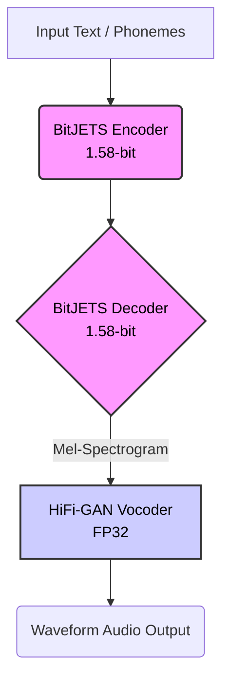

# BitJETS-M4: Extreme Edge TTS with 1.58-bit Quantization

[](https://pytorch.org/)
[-9cf.svg?style=flat&logo=apple&logoColor=white)]()
[]()
[]()

> **Generative Audio on the Edge:** Implementing Microsoft's bleeding-edge [BitNet b1.58](https://arxiv.org/abs/2402.17764) architecture for Text-to-Speech, trained entirely on consumer hardware (MacBook Pro M4).

## 📌 Abstract

**BitJETS-M4** is an experimental acoustic model for Text-to-Speech (TTS) that pushes the boundaries of model compression and efficiency. By adopting the 1.58-bit quantization paradigm (where weights are constrained to ternary values $\{-1, 0, 1\}$), this project aims to enable high-quality generative audio on extreme edge devices (IoT, mobile, microcontrollers) with minimal memory footprint.

Unlike typical research conducted on massive GPU clusters, this model was built and trained from scratch on an **Apple Silicon M4 chip**, utilizing custom engineering solutions to overcome consumer hardware constraints.

## 🚀 Key Features & Achievements

* **Extreme Model Compression:**
    * The acoustic model achieves a **~90% reduction** in theoretical size compared to FP32 baselines.
    * Current unoptimized checkpoint size: **10.1 MB** (containing ~2.5M parameters in FP32 containers).
    * Theoretical packed size (using 2-bit indexing): **< 1 MB**.
* **Edge-Native Training Pipeline:**
    * Trained completely on macOS using **Metal Performance Shaders (MPS)** backend.
    * Implemented manual **Gradient Accumulation** to simulate large-batch High-Performance Computing (HPC) environments on limited VRAM.
* **BitNet Architecture Implementation:**
    * Custom `BitConv1d` layers built from first principles using **Straight-Through Estimators (STE)** for non-differentiable quantization backpropagation.
    * Incorporates **RMSNorm** and optimized **Residual Connections** for stable 1-bit training dynamics.

## 🏗️ Architecture Overview

This project utilizes a hybrid approach to balance efficiency and audio quality:

### 1. The Acoustic Model (BitJETS) - *1.58-bit Quantized*
An Encoder-Decoder architecture based on JETS/Transformer principles, responsible for converting phoneme sequences into Mel-Spectrograms.
* All major convolution and linear projection layers are replaced with custom **BitLinear/BitConv** variants.
* Weights are dynamically quantized to $\{-1, 0, 1\}$ during the forward pass.
* Activations are quantized to 8-bit range.

### 2. The Vocoder (HiFi-GAN) - *Full Precision (FP32)*
To ensure high-fidelity audio reconstruction, a full-precision HiFi-GAN vocoder converts the generated Mel-Spectrograms into continuous audio waveforms. Attempting to quantize the vocoder resulted in severe audio degradation, leading to this hybrid strategy.



## 🛠️ Engineering Challenges on M4

Training a generative model on a laptop presented unique challenges that required specific engineering solutions:

| Challenge | Solution Implemented |
| --- | --- |
| **VRAM Constraints** | The M4 chip cannot handle standard batch sizes (e.g., 32 or 64) for TTS training. I implemented **Gradient Accumulation** (processing mini-batches of 8 and updating weights every 4 steps) to simulate an effective batch size of 32, stabilizing stochastic gradients. |
| **MPS/Metal Limitations** | PyTorch's MPS backend has limitations with multi-process data loading (`num_workers > 0` often crashes). The pipeline was optimized for serial data loading without bottlenecking the GPU too severely. |
| **BitNet Instability (Loss Explosion)** | Initial training attempts saw massive loss spikes. Debugging revealed issues with standard Residual Connections (`x * F(x)` gating vs `x + F(x)` addition) in the context of discrete weights. Switching to additive residuals and adopting **RMSNorm** over LayerNorm fixed gradient flow. |

## 📊 Training Dynamics (WandB)

The training process demonstrates the distinct "L-shape" convergence curve typical of BitNet architectures, where the model quickly learns the discrete weight mapping after initial instability.

[MASUKKAN SCREENSHOT GRAFIK LOSS WANDB YANG BAGUS DI SINI]
*(Figure 1: Training Loss stabilizing after fixing residual connections at step ~164k)*

👉 **[View full training report on Weights & Biases](MASUKKAN LINK PUBLIC WANDB REPORT KAMU DISINI)**

## 🔊 Audio Samples (Epoch 200)

*Samples generated using BitJETS acoustic model + HiFi-GAN vocoder.*

| Text | Audio | Notes |
| --- | --- | --- |
| "Burger please." | [▶️ Listen](https://www.google.com/search?q=LINK_KE_FILE_AUDIO_1.wav) | Short utterance, clear phonemes. |
| "The quick brown fox jumps over the lazy dog." | [▶️ Listen](https://www.google.com/search?q=LINK_KE_FILE_AUDIO_2.wav) | Full alphabet test. |
| [Kalimat Lainhttps://www.google.com/search?q=...] | [▶️ Listen](https://www.google.com/search?q=...) | https://www.google.com/search?q=... |

*(Note: Slight robotic artifacts are expected due to extreme 1.58-bit quantization without final weight packing optimization.)*

## 💻 Installation & Usage

### Requirements

* Python 3.10+
* PyTorch (Nightly/Preview build recommended for best MPS support on macOS)
* Torchaudio, Librosa, WandB, Matplotlib

### Setup

```bash
git clone [https://github.com/username/BitJETS-M4.git](https://github.com/username/BitJETS-M4.git)
cd BitJETS-M4
pip install -r requirements.txt

```

### Inference Example

```bash
python main.py infer --model_path checkpoints/bitjets_ckpt_200.pth --text "Generative AI on the edge is the future." --output result.wav

```

## 🔮 Future Work

* **Weight Packing:** Implement post-training weight indexing to pack five ternary weights into a single int8 integer, realizing the true theoretical size of < 1MB.
* **Vocoder Quantization:** Researching methods to distill or quantize the vocoder component without destroying audio quality (e.g., using Multi-Stage Quantization).
* **On-Device Deployment:** Exporting the model to ONNX or CoreML for real-time inference demonstration on an iPhone or ESP32 microcontroller.

## 📜 References

1. Wang, H., et al. (2024). "BitNet: Scaling 1-bit Transformers for Large Language Models." [arXiv:2310.11453](https://www.google.com/search?q=https://arxiv.org/abs/2310.11453)
2. Ma, S., et al. (2024). "The Era of 1-bit LLMs: All Large Language Models are in 1.58 Bits." [arXiv:2402.17764](https://www.google.com/url?sa=E&source=gmail&q=https://arxiv.org/abs/2402.17764)
3. Wu, Y., et al. (2024). "BitTTS: Natively Quantized Text-to-Speech against Large Language Models."

